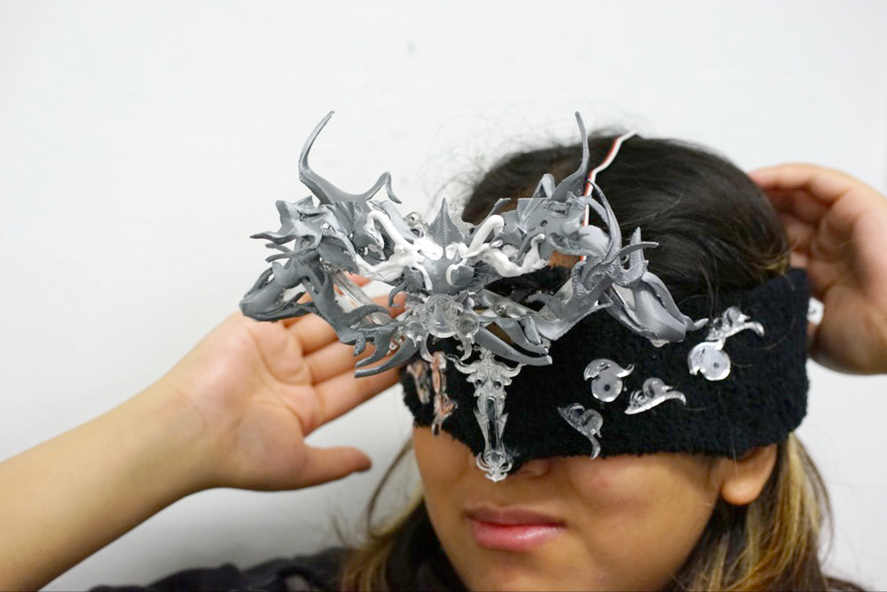
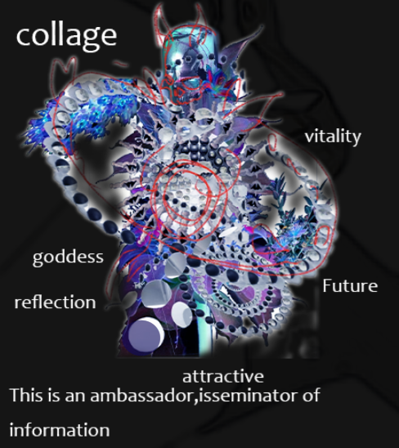
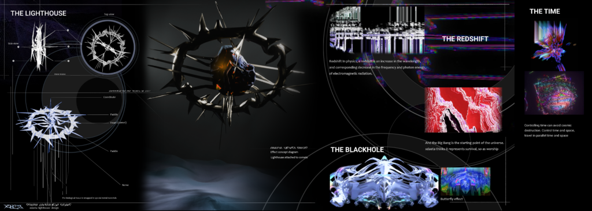
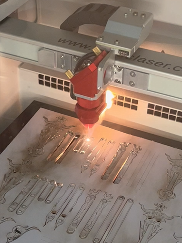
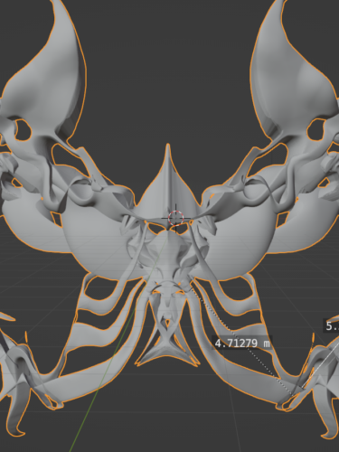
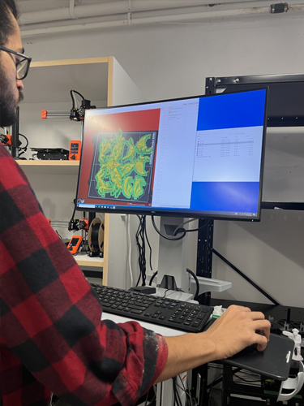
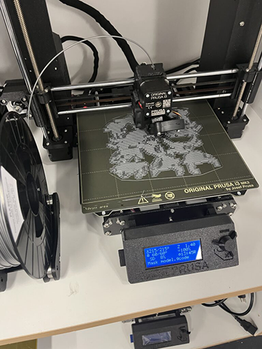
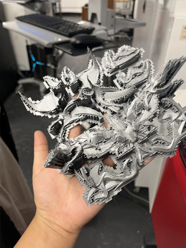
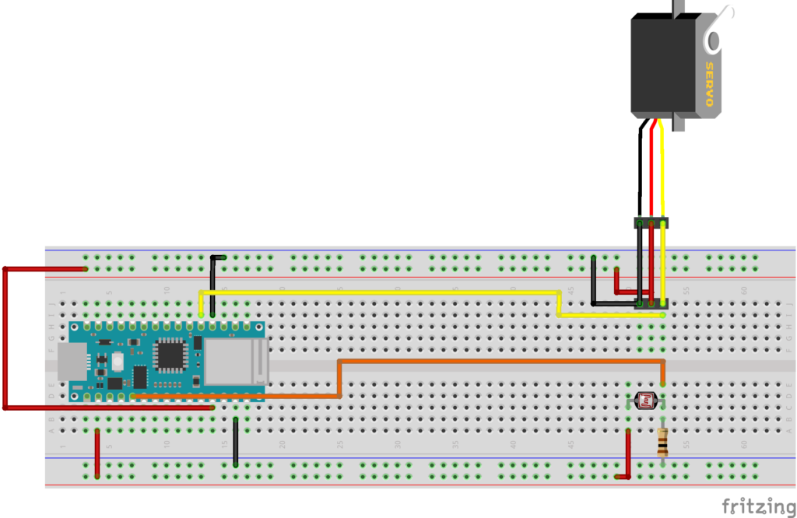
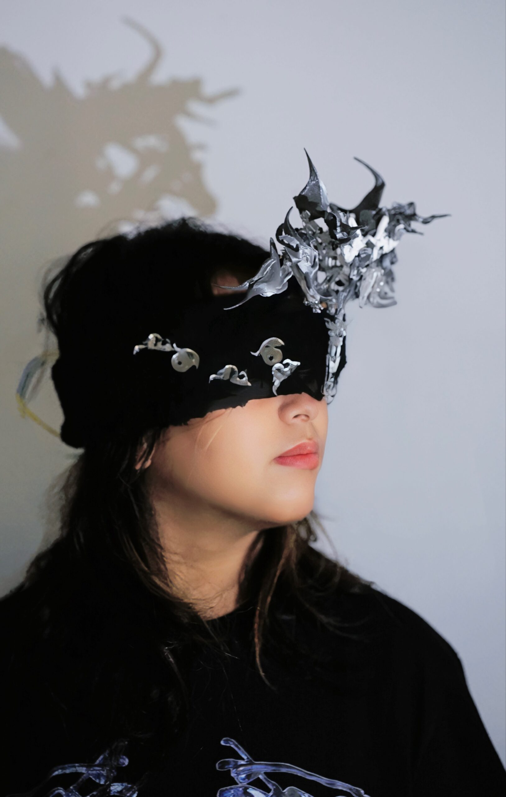

# Emotive Objects

***

### The Butterfly Effect: An Odyssey of Embodied Elegance

In the realm of artistic engineering, ideas morph from mere inspirations into tangible creations. The “butterfly effect” stands as a testament to this evolutionary journey of thought, material, and technological convergence.

**Group Members : Xinzhou Zhang, Ailin Dong, Samarth Reddy**

<figure><figcaption>
Final Prototype
</figcaption></figure>

#### Intro

An inspiration in the mind can trigger many changes in the outside world, from thinking to machinery, which is proof of human evolution. Inspiration in the human mind has been a driving force behind major innovations and advancements. Every invention, from the wheel to the internet, started as a thought. These inspirations lead to research, collaboration, and realization. Beyond technology, ideas in art, philosophy , and social sciences have shaped cultures. They signify not just technological evolution, but the growth of human thought and creativity. Each inspired moment adds to our collective progress, pushing boundaries and redefining our understanding of ourselves and the universe.

Regarding the title “Butterfly Effect”, we want to express that a small idea in the brain can sometimes make a big change in the world, just like the butterfly effect. We visualize this thinking process as a butterfly flapping its wings. The whole movement of the butterfly’s wing is controlled by a gesture to pat on the head (touch the sensor on the mask), which represents some gestures people often do while thinking. In this case it is like that, when you have a slight pat on your head, then inspiration can come into your mind.&#x20;

Additionally, we use a head band to cover the users’ eyes. It is because the thinking process happens in the brain, and we wanted to weaken the presence of vision to emphasize the thinking activity in the brain, similar to meditation with eyes closed.

#### Material Chosen

There are two layers in our project’s main body, one is skeleton, and one is the surface, which are both plastic. The whole plastic structure is also directly connected to the motor movement. Aside from the plastic, we used nails and foam to assist in fixing the structure.

#### Concept

Guided by Richard Serra’s Verb List – “To Spread, To Tighten, To Stretch”, ‘the butterfly effect’ showcases the properties of symmetry. Among these, the focus was on ‘To Spread’, although all three were explored during our research. These principles resonate through its structure, where one central joint commands its movement, mirroring the simplicity and efficiency of a foldable umbrella. The unity of these concepts offers a harmonious blend of aesthetic appeal and a sense of dynamic movements.

‘Butterfly effect’ is not just a static piece of art, but a dynamic amalgamation of engineering and design. At its core, the project leverages the capabilities of the Arduino Nano 33 IOT kit, providing a foundation of sensors(LDR) and actuation(Servo). This technological integration allows ‘Butterfly effect’ to interact and respond, blending art with technology. The structure and the overall artefact was meticulously crafted using a range of fabrication techniques, including laser cutting, 3D printing, and sculpting, and made use of materials like acrylic, metal, foam, and plastic.

<figure><figcaption></figcaption></figure>

 

<figure><figcaption></figcaption></figure>

 

<figure><figcaption></figcaption></figure>

 

<figure><figcaption></figcaption></figure>

**Demo** **Video**

The structural mechanism underwent numerous trials to ensure flawless operation. We faced challenges in enabling individual parts to move both independently and cohesively. After perfecting the mechanism, we attached the artefact to the structure. Below is a video demonstration showcasing the structure, artefact, and Arduino code working in harmony.


_Demo of ‘The Butterfly Effect’_


[_music composition_](https://ocaduniversity-my.sharepoint.com/:u:/r/personal/aileend\_ocadu\_ca/Documents/Microsoft%20Teams%20Chat%20Files/comforting%20rain.band.zip?csf=1\&web=1\&e=zMZR4F) _created by Aileen._

#### References and Inspirations

<figure><figcaption>
<em>inspiration of elements created by aileen</em>
</figcaption></figure>

_Autocad, Rhino, blender.org, fritzing.org, arduino.cc, tinkercad.com, chat.openai.com, code.visualstudio.com, github.com, Premier Pro, Garage band by apple_

#### Design & Functionality (Technical)

The skeleton of ‘butterfly effect’ is intricately crafted from laser-cut acrylic and is held together by nuts and bolts. This skeleton serves as a base upon which 3D-printed organic artefact is affixed using foam clay and super glue. Notably, the central acrylic component uses longer nails that penetrate through the skeleton, ensuring stability. To accentuate its appeal, delicate decorations are incorporated using foam clay, coupled with laser-cut elements.

Underpinning this structural marvel is a technological backbone powered by the Arduino Nano 33 IOT. Standard servos give life to its motion, and an LDR (Light Dependent Resistor) adds an interactive dimension, allowing the structure to respond to environmental light variations.

#### Mechanism Development

The mechanism’s design is inspired by the structure of a folding umbrella. We have studied how the folding umbrella can be expanded and contracted by controlling the movement of one point and then designed the initial structure. We found that the principle of folding umbrellas can move like that because several parallelograms in its structure constrain each other and control the opening and closing of the overall structure. Therefore, we then applied this principle in this structure as well. But during the assembling process, we made some further adjustments to better connect to the motor and to drive the whole structure.&#x20;

Bilow, Marcel. 2012. “Buckylab: HOW IT WORKS : UMBRELLA.” _Buckylab_ (blog). July 1, 2012. [https://buckylab.blogspot.com/2012/07/how-it-works-umbrella.html](https://buckylab.blogspot.com/2012/07/how-it-works-umbrella.html)

<figure><figcaption></figcaption></figure>

 

<figure><figcaption></figcaption></figure>

 

<figure><figcaption></figcaption></figure>

 

<figure><figcaption></figcaption></figure>

 

<figure><figcaption></figcaption></figure>

_Structure, laser cutting, 3D Model, 3D Printing, and Raw final artefact with structure_

#### Process

We designed the overall skeleton based on the structure of the folding umbrella first and added some patterns to the basic structure to beautify it. Then we first cut the original skin into 9 parts in Blender, measured the length of each part and adjusted the length of each skeleton accordingly. Then we 3d printed the skin, and laser cut the skeleton at the same time. Finally, the assembly was completed, and the motors were connected for some more debugging.

#### Circuit Diagram & Description

The code is written for an Arduino board to control a servo motor based on the readings from an analog sensor.

<figure><figcaption>
<em>Fritzing circuit diagram – sketch</em>
</figcaption></figure>

**Components and Libraries**:

* Standard Servo (along with servo.h library)
* LDR

**Pin Configuration**:

* **A1**: Analog sensor input.
* **Pin 9**: Servo motor control.

**Setup Function:**

* Initializes `A1` as an input pin.
* Starts the serial communication at a baud rate of 9600.
* Attaches the servo motor to pin 9 with a pulse width range of 500 to 2500 microseconds.

**Main Loop:**

* Reads the analog value from `A1` and prints it to the serial monitor.
* If the analog reading is less than 30, the servo motor is set to a 58° position, otherwise, it’s set to a 0° position. This 58° angle translates to a specific prismatic movement of attached components, ensuring the servo operates within designated limits.

**Delay:**

* Introduces a delay of 100 milliseconds in each iteration to prevent rapid fluctuations.

#### Final Code

The Final version of the Arduino-based servo control via LDR code is hosted in Github public repository. for complete details and to access the code, please visit the link below.

_ChatGPT was not utilized for writing the code. Instead, we experimented with code creation in TinkerCAD, and exported the code to the Arduino IDE. However, we did use ChatGPT for writing assistance, and to accurately articulate programming jargon within the comments of the code._

**Github Repo:** [Experiment 1](https://github.com/calluxpore/DGIF-6037-301-Creation---Computation)

#### Visuals

<figure><figcaption>
Final Prototype
</figcaption></figure>

#### Challenges and Insights

Creating the ‘butterfly effect’ presented a series of challenges. The task of binding diverse materials was daunting, especially with superglue. Detailed trimming of the 3D printed artefact was essential, and challenges emerged when separating the acrylic from the laser-cut board during operation. After soldering, issues arose from a faulty sensor due to misconnected wires. As time passed, the assembly’s nuts and bolts began to show wear. Yet, every challenge encountered was a stepping stone to refinement.

The journey to perfect the ‘butterfly effect’ was a unique exploration. As with all endeavors fueled by vision, it culminated in a remarkable blend of art, technology, and innovation. The ‘butterfly effect’ is more than a mere experiment; it stands as a testament to artistry, precision, and the infinite potential of human-inspired creativity. We’re eager to refine its design and mechanics in the upcoming months.

We thank Kate Hartman and Nick Puckett for their invaluable guidance, consultation, and discussions, as well as technicians Orit Zewge-Abubaker, Patricia Mwenda and Prayag Ichangimath for their immense support.
